```mermaid
graph TD
    A[🚀 Frontend Development] --> B[⚛️ React Ecosystem]
    A --> C[📱 Mobile Development]
    A --> D[🎨 UI/UX Design]
    B --> E[Next.js]
    B --> F[Redux Toolkit]
    C --> G[Flutter]
    C --> H[React Native]
    D --> I[Figma]
    D --> J[User Experience]
```

#  Hi there, I'm Komal Anil Gore

<div align="center">
  
</div>

<div align="center">
  
</div>

##  About Me

```javascript
const komal = {
    location: "India 🇮🇳",
    role: "Frontend Developer",
    passion: ["Coding", "UI/UX Design", "Problem Solving"],
    currentlyLearning: ["Advanced React", "Node.js", "Cloud Technologies"],
    funFact: "I debug with console.log and I'm not ashamed! 🐛",
    contact: "gorekomal40@gmail.com"
};
```

<div align="center">
  
  
</div>

## 🚀 Tech Stack & Tools

<div align="center">

### 💻 Programming Languages


### 📱 Mobile & Frontend


### 🛠️ Tools & Technologies  


### ☁️ Cloud & Backend


### 🎨 Design & Testing


</div>

## 📊 GitHub Analytics

<div align="center">
  
  
</div>

<div align="center">
  
</div>

## 🏆 GitHub Trophies

<div align="center">
  
</div>

## 📈 Contribution Graph

<div align="center">
  
</div>

## 🎯 Current Focus

<div align="center">



</div>

## 🌐 Connect With Me

<div align="center">
  
[](mailto:gorekomal40@gmail.com)
[](https://linkedin.com/in/komal-gore)
[](https://github.com/komalgore123)
[](https://your-portfolio.com)

</div>

## 💡 Quote of the Day

<div align="center">
  
</div>

---

<div align="center">
  
  
  ### ⭐ From [Komal Gore](https://github.com/komalgore123) with ❤️
  
  
</div>#  Hi there, I'm Komal Anil Gore

<div align="center">
  
</div>

<div align="center">
  
</div>

##  About Me

```javascript
const komal = {
    location: "India 🇮🇳",
    role: "Frontend Developer",
    passion: ["Coding", "UI/UX Design", "Problem Solving"],
    currentlyLearning: ["Advanced React", "Node.js", "Cloud Technologies"],
    funFact: "I debug with console.log and I'm not ashamed! 🐛",
    contact: "gorekomal40@gmail.com"
};
```

<div align="center">
  
  
</div>

## 🚀 Tech Stack & Tools

<div align="center">

### 💻 Programming Languages


### 📱 Mobile & Frontend


### 🛠️ Tools & Technologies  


### ☁️ Cloud & Backend


### 🎨 Design & Testing


</div>

## 📊 GitHub Analytics

<div align="center">
  
  
</div>

<div align="center">
  
</div>

## 🏆 GitHub Trophies

<div align="center">
  
</div>

## 📈 Contribution Graph

<div align="center">
  
</div>

## 🎯 Current Focus

<div align="center">


</div>

## 🌐 Connect With Me

<div align="center">
  
[](mailto:gorekomal40@gmail.com)
[](https://linkedin.com/in/komal-gore)
[](https://github.com/komalgore123)
[](https://your-portfolio.com)

</div>

## 💡 Quote of the Day

<div align="center">
  
</div>

---

<div align="center">
  
  
  ### ⭐ From [Komal Gore](https://github.com/komalgore123) with ❤️
  
  
</div>
